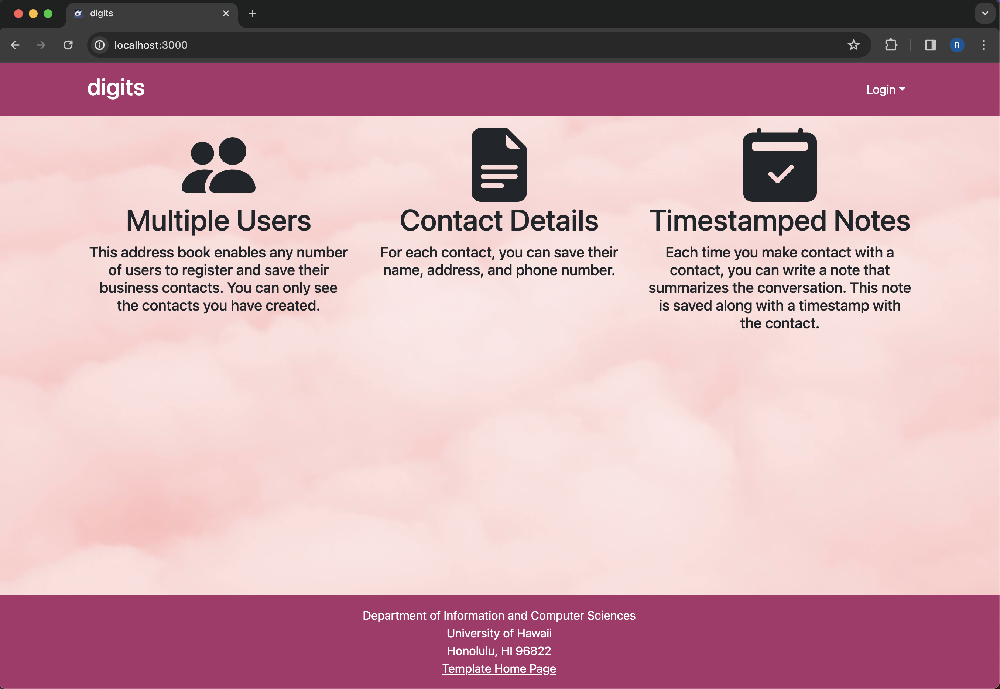
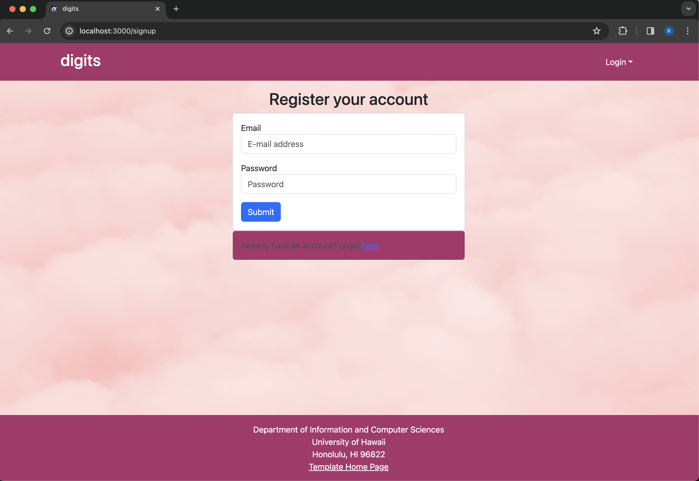
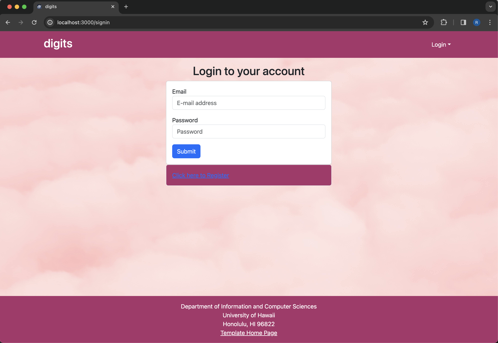
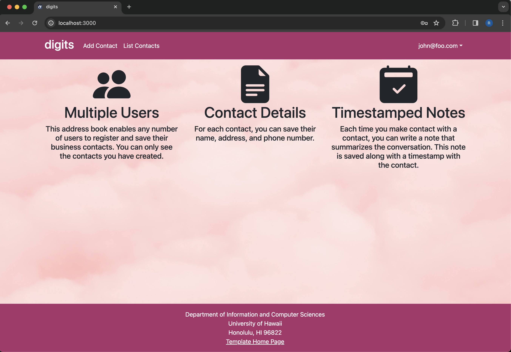
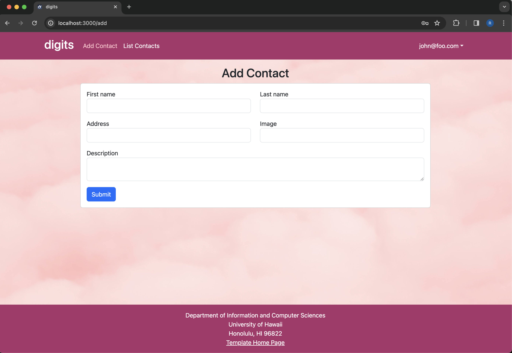
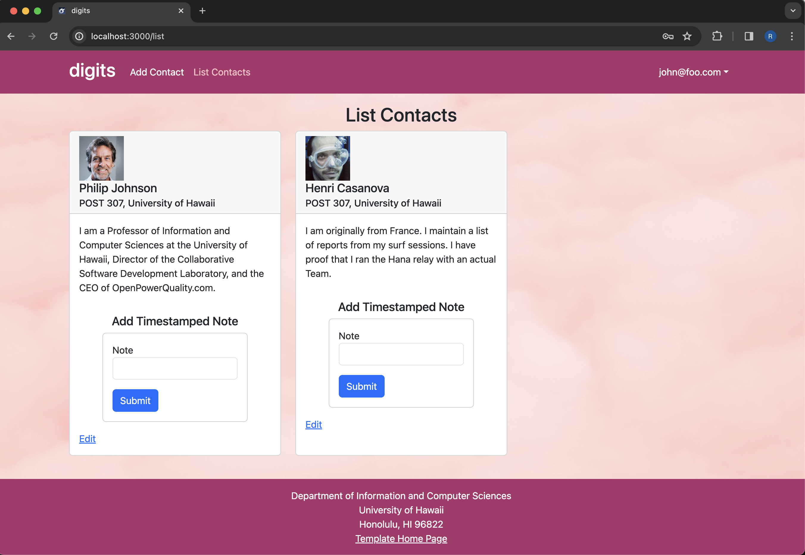
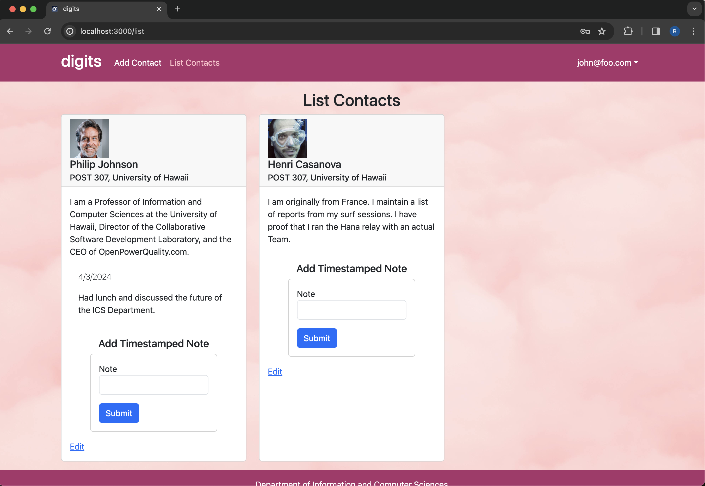
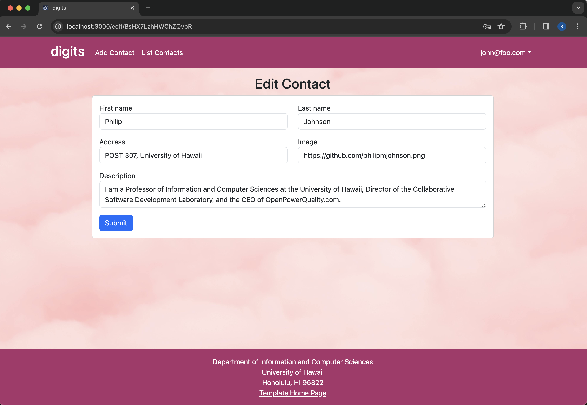
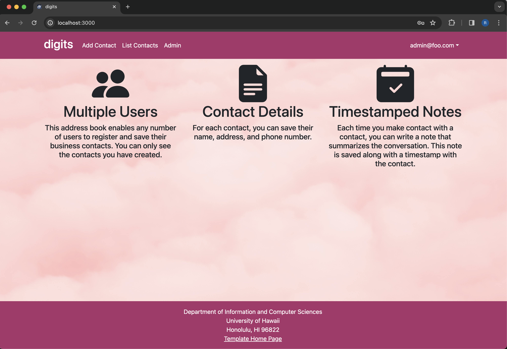
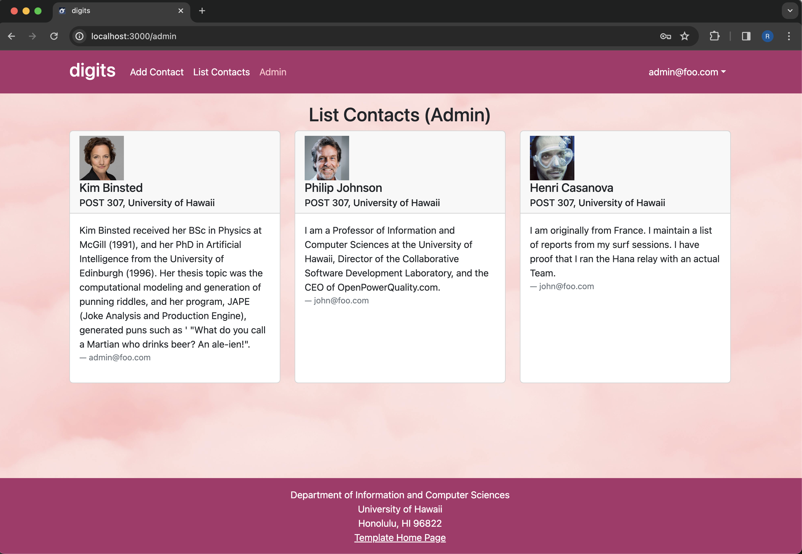

Digits is an application that allows users to: 

  * Register an account with multiple users.
  * Create and manage a set of contacts.
  * Add a set of timestamped notes regarding user's interactions with each contact.

### Installation

First, [install Meteor](https://www.meteor.com/install).

Second, go to [https://github.com/ics-software-engineering/meteor-application-template-react](https://github.com/ics-software-engineering/meteor-application-template-react), and click the "Use this template" button. Complete the dialog box to create a new repository that you own that is initialized with this template's files.

Third, go to your newly created repository, and click the "Clone or download" button to download your new GitHub repo to your local file system.  Using [GitHub Desktop](https://desktop.github.com/) is a great choice if you use MacOS or Windows.

Fourth, cd into the app/ directory of your local copy of the repo, and install the required libraries with:

```
$ meteor npm install
```

#### Running the system

Once the libraries are installed, you can run the application by invoking the "start" script in the [package.json file](https://github.com/ics-software-engineering/meteor-application-template-react/blob/master/app/package.json):

```
$ meteor npm run start
```

The first time you run the app, it will create some default users and data. Here is the output:

```
 meteor npm run start 

> meteor-application-template-react@ start /Users/philipjohnson/github/philipmjohnson/digits/app
> meteor --no-release-check --settings ../config/settings.development.json

[[[[[ ~/github/philipmjohnson/digits/app ]]]]]

=> Started proxy.                             
=> Started MongoDB.                           
I20180305-18:06:02.764(-10)? Creating the default user(s)
I20180305-18:06:02.803(-10)?   Creating user admin@foo.com.
I20180305-18:06:02.803(-10)?   Creating user john@foo.com.
I20180305-18:06:02.804(-10)? Creating default contacts.
I20180305-18:06:02.804(-10)?   Adding: Johnson (john@foo.com)
I20180305-18:06:02.804(-10)?   Adding: Casanova (john@foo.com)
I20180305-18:06:02.804(-10)?   Adding: Binsted (admin@foo.com)
=> Started your app.

=> App running at: http://localhost:3000/
W20180305-18:06:02.805(-10)? (STDERR) Note: you are using a pure-JavaScript implementation of bcrypt.
W20180305-18:06:02.805(-10)? (STDERR) While this implementation will work correctly, it is known to be
W20180305-18:06:02.806(-10)? (STDERR) approximately three times slower than the native implementation.
W20180305-18:06:02.806(-10)? (STDERR) In order to use the native implementation instead, run
W20180305-18:06:02.806(-10)? (STDERR) 
W20180305-18:06:02.806(-10)? (STDERR)   meteor npm install --save bcrypt
W20180305-18:06:02.806(-10)? (STDERR) 
W20180305-18:06:02.806(-10)? (STDERR) in the root directory of your application.
```

Periodically, you might see `Error starting Mongo (2 tries left): Cannot run replSetReconfig because the node is currently updating its configuration` after the `=> Started HMR server.`. It doesn't seem to be a problem since the MongoDB does start.

**Note regarding bcrypt warning.** You will also get the following message when you run this application:

```
Note: you are using a pure-JavaScript implementation of bcrypt.
While this implementation will work correctly, it is known to be
approximately three times slower than the native implementation.
In order to use the native implementation instead, run

  meteor npm install --save bcrypt

in the root directory of your application.
```

On some operating systems (particularly Windows), installing bcrypt is much more difficult than implied by the above message. Bcrypt is only used in Meteor for password checking, so the performance implications are negligible until your site has very high traffic. You can safely ignore this warning without any problems during initial stages of development.

#### Viewing the running app

If all goes well, the template application will appear at [http://localhost:3000](http://localhost:3000).  You can login using the credentials in [settings.development.json](https://github.com/ics-software-engineering/meteor-application-template-react/blob/main/config/settings.development.json), or else register a new account.

#### ESLint

You can verify that the code obeys our coding standards by running ESLint over the code in the imports/ directory with:

```
meteor npm run lint
```

### User Interface Walkthrough

The following sections describe the major features of this template.

#### Landing Page

When you first bring up the application, you will see the landing page that provides a brief introduction to the capabilities of Digits:


#### Register

If you do not yet have an account on the system, you can register by clicking on “Login”, then “Sign Up”:



#### Sign In

Click on the Login link, then click on the Signin link to bring up the Sign In page which allows you to login:



#### User Home Page

After successfully logging in, the system takes you to your home page. It is just like the landing page, but the NavBar contains links to list contact and add new contacts:



#### Add Contacts

Clicking on the Add Contacts link brings up a page where you can now add new contacts:



#### List Contacts

Clicking on the List Contacts link brings up a page that lists all of the contacts associated with the logged in user:



This page also allows the user to add timestamped “notes” detailing interactions they’ve had with the contact. For example:



You can click the "Edit" link to go to the Edit Contact page, shown next.

#### Edit Contact

From the List Contacts page, the user can click the “Edit” link associated with any contact to bring up a page that allows that contact information to be edited:



#### Landing (after Login), Admin User

You can define an "admin" user in the settings.json file. It is possible to designate one or more users as “Admins” through the settings file. When a user has the Admin role, they get access to a special entry in the navbar that retrieves a page listing all contacts associated with all users:



#### Admin Page (list all users contacts)

To provide a simple example of a "super power" for Admin users, the Admin page lists all of the contacts by all of the users:



Note that non-admin users cannot get to this page, even if they type in the URL by hand.
